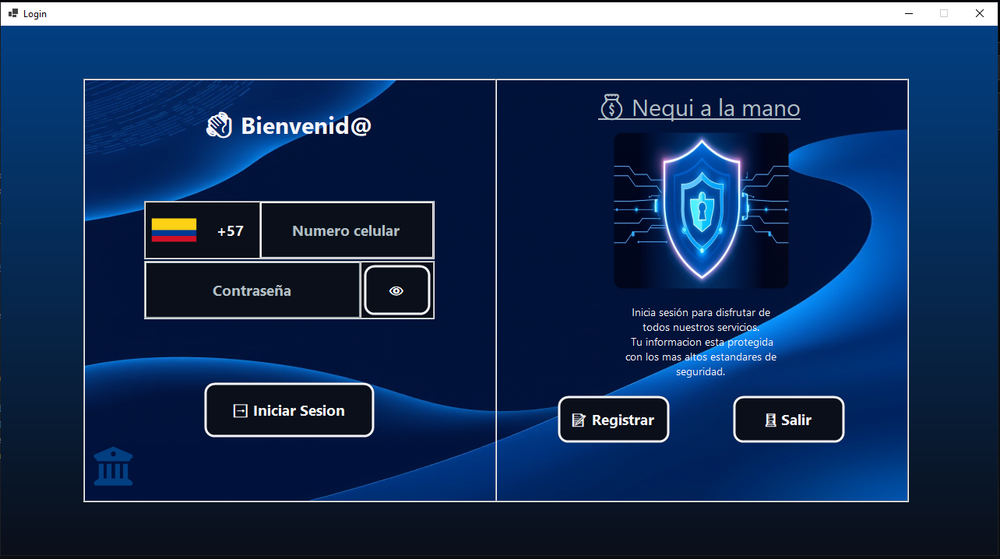
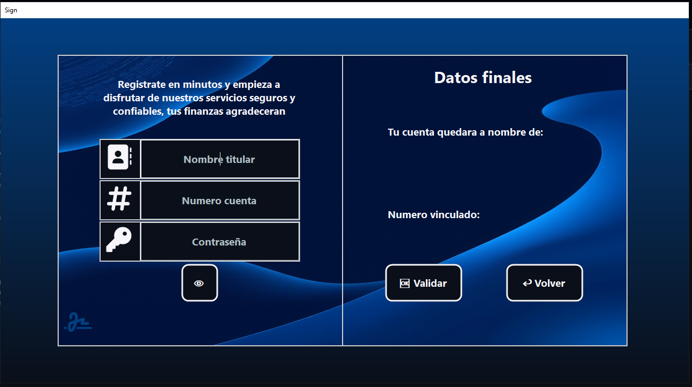
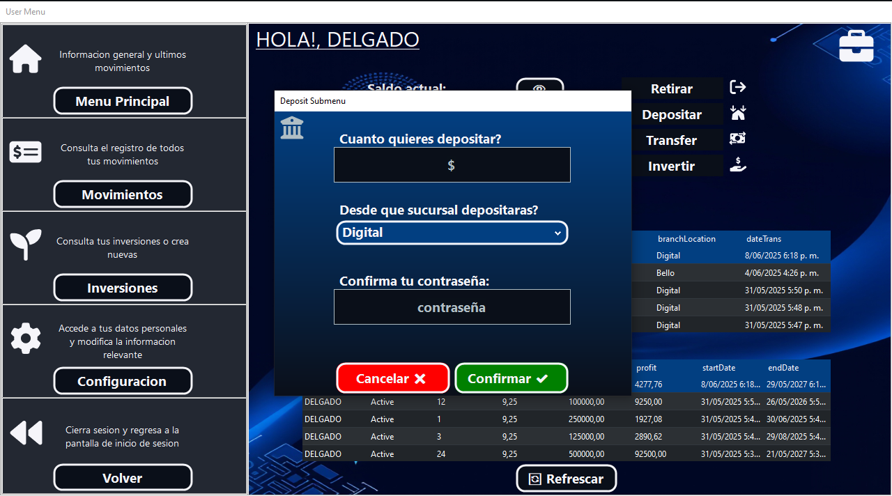
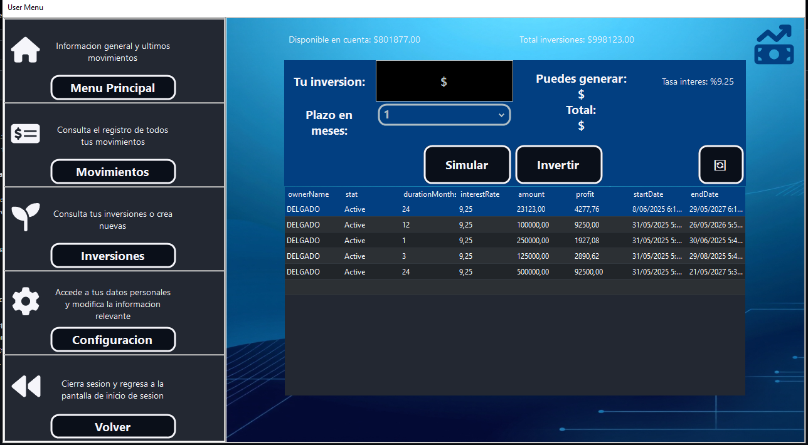
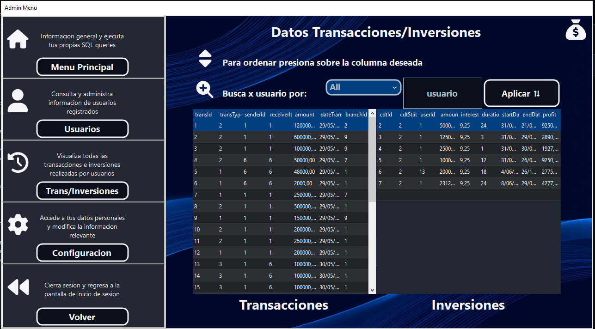
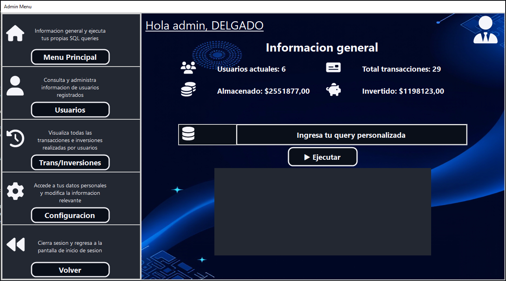

# BankProject - C# 

Este es un proyecto de una aplicación bancaria de escritorio para Windows desarrollado en C# usando WindowsForms con conexión a una 
base de datos SQL Server para funcionamiento en local.

## 🚀 Funcionalidades principales

- Registro de cuentas bancarias
- Depósitos, retiros, transferencias y inversiones en CDTs
- Consulta de movimientos
- Encriptado de contraseñas
- Comprobacion de datos y formatos correctos en inputs de los diferentes formularios

---

## 🛠️ Instalación y configuración

### 1 Clonar o descargar el repositorio
### 2 Ir a SQLServer y ejecutar el script "_01Desing.sql"
### 3 Ir a archivo "appsettings.json" y añadir tu conexion SQLServer a linea "DefaultConnection"
### 4 Abrir solucion en Visual Studio y probar el proyecto
### 5 Acceso a usuario administrador, Numero: "1111111111" - Contraseña: "sudo"

## 🖼️ Previsualizaciones

